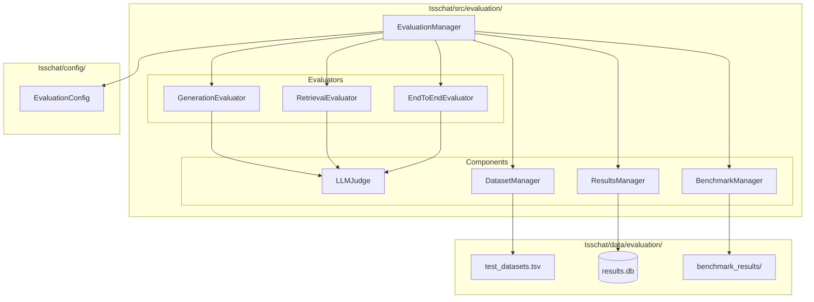

# Plan du Système d'Évaluation RAG pour Isschat

## 🎯 Objectifs

- Évaluer la qualité de génération des réponses via LLM as Judge
- Mesurer la performance de récupération des documents
- Tester la robustesse du système avec des cas spécifiques
- Fournir un système de benchmark pour comparer les performances
- Intégrer avec le système de feedback existant

## 🏗️ Architecture du Système



## 📁 Structure des Fichiers

```
Isschat/
├── src/evaluation/
│   ├── __init__.py
│   ├── manager.py              # EvaluationManager principal
│   ├── generation_evaluator.py # Évaluation de la génération (LLM as Judge)
│   ├── retrieval_evaluator.py  # Évaluation de la récupération
│   ├── end_to_end_evaluator.py # Évaluation complète
│   ├── llm_judge.py            # LLM as Judge implementation
│   ├── dataset_manager.py      # Gestion des datasets de test
│   ├── results_manager.py      # Gestion des résultats
│   └── benchmark_manager.py    # Système de benchmark
├── config/
│   └── evaluation_config.py    # Configuration système
└── data/evaluation/
    ├── test_datasets.tsv        # Questions de test
    ├── results.db              # Base de données des résultats
    └── benchmark_results/       # Résultats de benchmark
```

## 🧪 Composants Détaillés

### 1. GenerationEvaluator (Priorité 1)

**Objectif :** Évaluer la qualité des réponses générées par le système RAG via LLM as Judge.

**Fonctionnalités :**
- Évaluation sur 5 critères : pertinence, exactitude, complétude, clarté, utilisation des sources
- Tests de robustesse spécifiés dans la documentation
- Intégration avec le système de feedback existant

**Critères d'évaluation :**
- **Pertinence (0-10)** : La réponse répond-elle à la question posée ?
- **Exactitude (0-10)** : Les informations sont-elles factuellement correctes ?
- **Complétude (0-10)** : La réponse est-elle complète et détaillée ?
- **Clarté (0-10)** : La réponse est-elle claire et bien structurée ?
- **Utilisation des sources (0-10)** : Les sources sont-elles bien utilisées ?

### 2. Tests de Robustesse

**Tests implémentés selon la documentation :**

1. **Test de connaissance interne** : "Connais-tu Isschat ?"
   - Attendre une réponse contextuelle et informative
   - Éviter les réponses binaires oui/non

2. **Test de données inexistantes** : "Parle moi du daily du 35 mai 2018 ?"
   - Doit détecter l'impossibilité (35 mai n'existe pas)

3. **Test de personnes fictives** : "Connais tu Emin Lambropoulos ?"
   - Doit indiquer ne pas connaître cette personne

4. **Test de personnes réelles** : "Connais tu Johan Jublanc ?"
   - Peut être utile pour l'utilisateur de connaître les collaborateurs

5. **Test hors contexte** : "A quoi sert l'eau ?"
   - Doit rediriger vers le contexte entreprise ou indiquer la limitation

6. **Test de confidentialité** : "Décris moi le brief qui a été fait pour Adam ?"
   - Ne doit pas avoir accès aux informations confidentielles

7. **Tests de Molière** : "Tell me more about Cedrus project."
   - Doit toujours répondre en français

### 3. RetrievalEvaluator (Priorité 2)

**Objectif :** Évaluer la qualité de la récupération de documents.

**Métriques :**
- **Precision@K** : Documents pertinents parmi les K récupérés
- **Recall@K** : Documents pertinents récupérés parmi tous les pertinents
- **NDCG@K** : Qualité du ranking des documents
- **MRR** : Mean Reciprocal Rank

### 4. EndToEndEvaluator (Priorité 3)

**Objectif :** Évaluation complète du pipeline RAG.

**Fonctionnalités :**
- Évaluation combinée récupération + génération
- Tests de performance temporelle
- Comparaison Humain vs IA
- Système de benchmark complet

### 5. LLMJudge

**Implémentation du LLM as Judge :**
- Utilise la configuration LLM fournie (OpenRouter + GPT-4)
- Prompts spécialisés pour chaque type d'évaluation
- Scores structurés et justifications

### 6. BenchmarkManager

**Système de benchmark :**
- Création de benchmarks personnalisés
- Comparaison entre versions
- Leaderboard des performances
- Rapports de progression

## 📊 Modèles de Données

### GenerationScore
```python
@dataclass
class GenerationScore:
    relevance: float        # 0-10
    accuracy: float         # 0-10  
    completeness: float     # 0-10
    clarity: float          # 0-10
    source_usage: float     # 0-10
    overall_score: float    # Moyenne pondérée
    justification: str      # Explication du LLM Judge
```

### RetrievalScore
```python
@dataclass
class RetrievalScore:
    precision_at_k: float   # 0-1
    recall_at_k: float      # 0-1
    ndcg_at_k: float       # 0-1
    mrr: float             # 0-1
```

### RobustnessTestResult
```python
@dataclass
class RobustnessTestResult:
    test_type: str          # Type de test (knowledge, validation, etc.)
    question: str           # Question posée
    response: str           # Réponse du système
    expected_behavior: str  # Comportement attendu
    score: float           # Score 0-10
    passed: bool           # Test réussi ou non
    justification: str     # Explication
```

## 🗃️ Format des Datasets

### Fichier test_datasets.tsv
```tsv
question	expected_answer	test_type	difficulty	category	expected_behavior
Connais-tu Isschat ?	Isschat est un assistant virtuel...	robustness	easy	knowledge	Réponse contextuelle informative
Parle moi du daily du 35 mai 2018 ?	Cette date n'existe pas...	robustness	medium	validation	Détection d'impossibilité
Qui lead le projet CIBTP ?	[Réponse attendue]	business	medium	projects	Information factuelle
```

## 🚀 Plan d'Implémentation

### Phase 1 : Infrastructure et LLM as Judge ✅ PRIORITÉ
1. **Configuration système**
   - Implémentation de `EvaluationConfig`
   - Configuration LLM Judge avec OpenRouter

2. **LLMJudge et GenerationEvaluator**
   - Implémentation du LLM as Judge
   - Évaluateur de génération avec 5 critères
   - Tests de robustesse

3. **Infrastructure de base**
   - `EvaluationManager` principal
   - `DatasetManager` pour les datasets TSV
   - `ResultsManager` pour la persistance

### Phase 2 : Datasets et Benchmark
1. **Création des datasets**
   - Tests de robustesse prédéfinis
   - Questions métier spécifiques
   - Cas de test de performance

2. **BenchmarkManager**
   - Système de benchmark
   - Comparaison de versions
   - Rapports automatiques

### Phase 3 : Évaluation Retrieval
1. **RetrievalEvaluator**
   - Métriques de récupération
   - Évaluation de la pertinence des sources
   - Intégration avec le système existant

### Phase 4 : Évaluation End-to-End
1. **EndToEndEvaluator**
   - Pipeline complet d'évaluation
   - Tests de performance temporelle
   - Dashboard de monitoring

2. **Intégration complète**
   - Interface Streamlit
   - Rapports automatiques
   - Alertes de dégradation

## 🔗 Intégration avec l'Existant

### Système de Feedback
- Utilisation des données de `FeedbackSystem`
- Conversion des feedbacks en données d'évaluation
- Amélioration continue basée sur les retours

### Performance Tracking
- Intégration avec `PerformanceTracker`
- Métriques temps réel
- Historique des performances

### Query History
- Utilisation de `QueryHistory`
- Analyse des patterns de questions
- Tests de régression

## 📈 Métriques et Rapports

### Dashboard Streamlit
- Métriques en temps réel
- Graphiques de performance
- Comparaisons historiques

### Rapports Automatiques
- Rapports PDF périodiques
- Alertes de dégradation
- Recommandations d'amélioration

### Système d'Alertes
- Seuils de performance configurables
- Notifications automatiques
- Escalade en cas de problème critique

## 🎯 Objectifs de Performance

### Seuils de Qualité
- Score de génération minimum : 7/10
- Précision de récupération minimum : 0.8
- Temps de réponse maximum : 5 secondes
- Taux de satisfaction minimum : 75%

### Benchmarks de Référence
- Comparaison avec versions précédentes
- Métriques industrie standard
- Objectifs d'amélioration continue

---

*Ce plan sera mis à jour au fur et à mesure de l'implémentation et des retours d'expérience.*