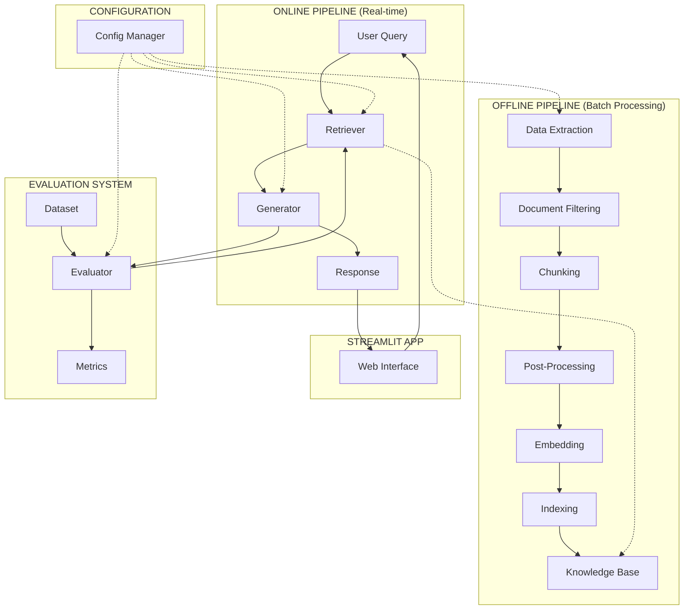
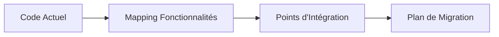

# Plan de Refactoring RAG - Architecture Modulaire et Maintenable

## 🎯 **Objectifs du Refactoring**

1. **Séparation des responsabilités** : Découpler les composants pour une meilleure maintenabilité
2. **Pipeline offline/online** : Séparer la préparation des données de l'utilisation en temps réel
3. **Flexibilité** : Permettre le changement facile de base de données vectorielle
4. **Extensibilité** : Préparer l'architecture pour les futures stratégies de récupération
5. **Code propre** : Structure claire et testable
6. **Intégration d'évaluation** : Interface programmatique pour les systèmes d'évaluation

## 🏗️ **Architecture Proposée**



## 📁 **Structure de Fichiers Proposée**

```
Isschat/
├── src/
│   ├── core/
│   │   ├── __init__.py
│   │   ├── config.py                    # Configuration centralisée
│   │   ├── interfaces.py                # Interfaces abstraites
│   │   └── exceptions.py                # Exceptions personnalisées
│   │
│   ├── data_pipeline/                   # OFFLINE PIPELINE
│   │   ├── __init__.py
│   │   ├── extractors/
│   │   │   ├── __init__.py
│   │   │   ├── base_extractor.py        # Interface abstraite
│   │   │   └── confluence_extractor.py  # Extraction Confluence
│   │   ├── processors/
│   │   │   ├── __init__.py
│   │   │   ├── document_filter.py       # Filtrage qualité
│   │   │   ├── chunker.py              # Découpage documents
│   │   │   └── post_processor.py       # Post-traitement
│   │   ├── embeddings/
│   │   │   ├── __init__.py
│   │   │   ├── base_embedder.py        # Interface abstraite
│   │   │   └── huggingface_embedder.py # Implémentation HF
│   │   └── pipeline_manager.py         # Orchestrateur pipeline
│   │
│   ├── vector_store/                   # INDEXING & STORAGE
│   │   ├── __init__.py
│   │   ├── base_store.py              # Interface abstraite
│   │   ├── faiss_store.py             # Implémentation FAISS
│   │   └── store_factory.py           # Factory pattern
│   │
│   ├── retrieval/                     # ONLINE RETRIEVAL
│   │   ├── __init__.py
│   │   ├── base_retriever.py          # Interface abstraite
│   │   ├── simple_retriever.py        # Récupération simple actuelle
│   │   └── retriever_factory.py       # Factory pour futures stratégies
│   │
│   ├── generation/                    # ONLINE GENERATION
│   │   ├── __init__.py
│   │   ├── base_generator.py          # Interface abstraite
│   │   ├── openrouter_generator.py    # Générateur OpenRouter
│   │   └── prompt_templates.py        # Templates de prompts
│   │
│   ├── rag_system/                    # ORCHESTRATION RAG
│   │   ├── __init__.py
│   │   ├── rag_pipeline.py           # Pipeline RAG principal
│   │   └── response_formatter.py      # Formatage réponses
│   │
│   ├── evaluation/                    # SYSTÈME D'ÉVALUATION
│   │   ├── __init__.py
│   │   ├── evaluator.py              # Évaluateur principal
│   │   ├── metrics_collector.py       # Collecte de métriques
│   │   └── batch_processor.py         # Traitement par lots
│   │
│   ├── webapp/                        # STREAMLIT INTERFACE
│   │   ├── __init__.py
│   │   ├── app.py                    # Application principale
│   │   ├── pages/
│   │   │   ├── __init__.py
│   │   │   ├── chat_page.py
│   │   │   ├── admin_page.py
│   │   │   └── history_page.py
│   │   └── components/
│   │       ├── __init__.py
│   │       └── sidebar.py
│   │
│   ├── migration/                     # OUTILS DE MIGRATION
│   │   ├── __init__.py
│   │   ├── legacy_adapter.py         # Adaptateur code legacy
│   │   ├── pipeline_migrator.py      # Migration pipeline
│   │   ├── vector_store_migrator.py  # Migration vector store
│   │   └── migration_dashboard.py    # Suivi migration
│   │
│   └── utils/                         # UTILITAIRES
│       ├── __init__.py
│       ├── logging_config.py
│       └── helpers.py
│
├── scripts/                           # SCRIPTS DE GESTION
│   ├── build_knowledge_base.py        # Script de construction offline
│   ├── rebuild_index.py              # Script de reconstruction
│   ├── migrate_to_new_architecture.py # Script de migration
│   ├── evaluate_system.py            # Script d'évaluation
│   └── health_check.py               # Vérification système
│
├── tests/                            # TESTS
│   ├── unit/
│   ├── integration/
│   ├── migration/
│   └── conftest.py
│
├── config/                           # CONFIGURATIONS
│   ├── pipeline_config.yaml          # Config pipeline
│   ├── retrieval_config.yaml         # Config récupération
│   └── eval_config.yaml              # Config évaluation
│
├── evaluation/                       # DONNÉES D'ÉVALUATION
│   ├── datasets/
│   ├── results/
│   └── benchmarks/
│
└── data/                            # DONNÉES
    ├── raw/                         # Données brutes
    ├── processed/                   # Données traitées
    └── vector_db/                   # Base vectorielle
```

## 🔧 **Composants Détaillés**

### **1. Interfaces Abstraites (Core)**

```python
# src/core/interfaces.py
from abc import ABC, abstractmethod
from typing import List, Dict, Any, Tuple

class BaseExtractor(ABC):
    """Interface pour l'extraction de données"""
    
    @abstractmethod
    def extract(self) -> List[Document]:
        pass

class BaseVectorStore(ABC):
    """Interface pour toutes les bases vectorielles"""
    
    @abstractmethod
    def save_documents(self, documents: List[Dict], embeddings: List[List[float]]) -> None:
        pass
    
    @abstractmethod
    def search(self, query_embedding: List[float], top_k: int = 5) -> List[Dict]:
        pass

class BaseRetriever(ABC):
    """Interface pour tous les retrievers"""
    
    @abstractmethod
    def retrieve(self, query: str, top_k: int = 5) -> Tuple[List[Dict], List[float]]:
        pass

class BaseGenerator(ABC):
    """Interface pour tous les générateurs"""
    
    @abstractmethod
    def generate(self, query: str, context_docs: List[Dict]) -> str:
        pass

class BaseEmbedder(ABC):
    """Interface pour tous les embedders"""
    
    @abstractmethod
    def embed_documents(self, texts: List[str]) -> List[List[float]]:
        pass
    
    @abstractmethod
    def embed_query(self, text: str) -> List[float]:
        pass
```

### **2. Data Pipeline (Offline)**

**Extractors** : Extraction modulaire des données
- Interface `BaseExtractor` pour différentes sources
- `ConfluenceExtractor` pour l'extraction Confluence actuelle
- Facilite l'ajout de nouvelles sources (SharePoint, fichiers, etc.)

**Processors** : Traitement et préparation
- `DocumentFilter` : Filtrage qualité avec scores
- `Chunker` : Découpage intelligent avec stratégies configurables
- `PostProcessor` : Enrichissement et préparation pour l'indexation

**Embeddings** : Vectorisation modulaire
- Interface `BaseEmbedder` pour différents modèles
- `HuggingFaceEmbedder` pour l'implémentation actuelle
- Facilite le changement de modèles d'embedding

### **3. Vector Store (Storage)**

**Abstraction de la base vectorielle** :
- Interface `BaseVectorStore` pour l'indépendance de la DB
- `FAISSStore` pour l'implémentation actuelle
- `StoreFactory` pour instancier la bonne implémentation
- Facilite la migration vers Chroma, Pinecone, etc.

### **4. Retrieval System (Online)**

**Récupération modulaire** :
- Interface `BaseRetriever` pour différentes stratégies
- `SimpleRetriever` pour la logique actuelle
- Architecture prête pour Parent/Contextual Retrieval

### **5. Generation System (Online)**

**Génération modulaire** :
- Interface `BaseGenerator` pour différents LLMs
- `OpenRouterGenerator` pour l'implémentation actuelle
- `PromptTemplates` pour la gestion centralisée des prompts

### **6. RAG System (Orchestration)**

**Pipeline principal** :
- `RAGPipeline` : Orchestrateur principal retrieval + generation
- `ResponseFormatter` : Formatage et enrichissement des réponses

## 🧪 **Système d'Évaluation Intégré**

### **Interface Programmatique Simple**

```python
# Exemple d'utilisation pour l'évaluation
from src.rag_system.rag_pipeline import RAGPipeline
from src.evaluation.evaluator import IsschatEvaluator

# 1. Configuration pour l'évaluation
evaluator = IsschatEvaluator(config_path="config/eval_config.yaml")

# 2. Évaluation sur un dataset
def evaluate_on_dataset(questions_answers_dataset):
    results = []
    
    for item in questions_answers_dataset:
        question = item["question"]
        expected_answer = item["expected_answer"]
        
        # Génération de la réponse
        result = evaluator.evaluate_single_query(question)
        
        # Ajout des métriques de référence
        result["expected_answer"] = expected_answer
        results.append(result)
    
    return results
```

### **Évaluateur Principal**

```python
# src/evaluation/evaluator.py
class IsschatEvaluator:
    """Évaluateur pour Isschat compatible avec n'importe quel framework d'éval"""
    
    def __init__(self, config_path: str = "config/eval_config.yaml"):
        self.rag_pipeline = RAGPipeline.from_config(config_path)
        self.metrics_collector = MetricsCollector()
    
    def evaluate_single_query(self, question: str, context: dict = None) -> dict:
        """Évalue une seule question - interface standard pour l'éval"""
        
        start_time = time.time()
        
        # Génération de la réponse
        answer, sources = self.rag_pipeline.process_query(question)
        
        response_time = time.time() - start_time
        
        # Collecte des métriques détaillées
        return {
            "question": question,
            "answer": answer,
            "sources": sources,
            "response_time": response_time,
            "retrieved_documents": self._get_retrieved_docs(),
            "retrieval_scores": self._get_retrieval_scores(),
            "token_count": self._count_tokens(answer),
            "context": context or {}
        }
    
    def evaluate_batch(self, dataset: List[dict]) -> List[dict]:
        """Évaluation en lot pour de gros datasets"""
        
        results = []
        for item in tqdm(dataset, desc="Evaluating"):
            result = self.evaluate_single_query(
                question=item["question"],
                context=item.get("context", {})
            )
            
            # Ajouter les métriques de référence si disponibles
            if "expected_answer" in item:
                result["expected_answer"] = item["expected_answer"]
            
            results.append(result)
        
        return results
```

### **Intégration avec Frameworks d'Évaluation Externes**

```python
# evaluation/integrations/ragas_integration.py
from ragas import evaluate
from ragas.metrics import faithfulness, answer_relevancy, context_precision

def integrate_with_ragas(isschat_evaluator, dataset):
    """Intégration avec RAGAS pour l'évaluation automatique"""
    
    # Génération des réponses avec Isschat
    results = isschat_evaluator.evaluate_batch(dataset)
    
    # Conversion au format RAGAS
    ragas_dataset = Dataset.from_dict({
        "question": [r["question"] for r in results],
        "answer": [r["answer"] for r in results],
        "contexts": [[doc["content"] for doc in r["retrieved_documents"]] for r in results],
        "ground_truths": [r.get("expected_answer", "") for r in results]
    })
    
    # Évaluation avec RAGAS
    ragas_results = evaluate(
        ragas_dataset,
        metrics=[faithfulness, answer_relevancy, context_precision]
    )
    
    return ragas_results

# evaluation/integrations/custom_metrics.py
class CustomMetrics:
    """Métriques personnalisées pour Isschat"""
    
    @staticmethod
    def source_accuracy(retrieved_docs, expected_sources):
        """Vérifie si les bonnes sources ont été récupérées"""
        retrieved_sources = {doc["metadata"]["source"] for doc in retrieved_docs}
        expected_sources = set(expected_sources)
        
        intersection = retrieved_sources.intersection(expected_sources)
        return len(intersection) / len(expected_sources) if expected_sources else 0
    
    @staticmethod
    def response_completeness(answer, expected_keywords):
        """Vérifie si la réponse contient les mots-clés attendus"""
        answer_lower = answer.lower()
        found_keywords = [kw for kw in expected_keywords if kw.lower() in answer_lower]
        return len(found_keywords) / len(expected_keywords) if expected_keywords else 0
```

## ⚙️ **Configuration YAML**

### **pipeline_config.yaml**
```yaml
data_extraction:
  source_type: "confluence"
  batch_size: 100
  timeout_seconds: 300

document_filtering:
  enabled: true
  min_content_length: 50
  quality_threshold: 0.7

chunking:
  strategy: "recursive"
  chunk_size: 512
  chunk_overlap: 20
  separators: ["\n\n", "\n", ". ", " "]

embedding:
  model_name: "all-MiniLM-L6-v2"
  batch_size: 16
  normalize: true

vector_store:
  type: "faiss"  # Facilite le changement vers "chroma", "pinecone", etc.
  persist_directory: "data/vector_db"
```

### **eval_config.yaml**
```yaml
evaluation:
  mode: "batch"  # Pas d'interface Streamlit
  
retrieval:
  strategy: "simple"
  top_k: 5
  score_threshold: 0.7

generation:
  model: "openai/gpt-4.1-mini"
  temperature: 0.0  # Déterministe pour l'éval
  max_tokens: 512

vector_store:
  type: "faiss"
  persist_directory: "data/vector_db"

logging:
  level: "INFO"
  capture_intermediate_results: true  # Pour debugging

metrics:
  custom_metrics:
    - "source_accuracy"
    - "response_completeness"
    - "response_time"
  external_frameworks:
    - "ragas"
```

## 🔄 **Stratégie de Migration Progressive**

### **Principe : Migration Sans Interruption de Service**

La migration se fera par **couches successives** en maintenant la compatibilité avec l'existant à chaque étape.

### **📋 Phase 0 : Préparation (2-3 jours)**

#### **Analyse de l'Existant**


**Actions concrètes :**
1. **Audit du code existant** : Identifier toutes les dépendances
2. **Créer une branche de migration** : `feature/rag-refactoring`
3. **Tests de régression** : S'assurer que tout fonctionne avant migration
4. **Backup de la base vectorielle** : Sauvegarder `db/` existant

#### **Structure de Transition**
```
Isschat/
├── src/
│   ├── legacy/                    # Code existant (temporaire)
│   │   ├── help_desk.py          # Ancien système
│   │   ├── load_db.py            # Ancien loader
│   │   └── isschat_webapp.py     # Ancienne interface
│   │
│   ├── new_architecture/          # Nouvelle architecture
│   │   ├── core/
│   │   ├── data_pipeline/
│   │   └── ...
│   │
│   └── migration/                 # Adaptateurs de transition
│       ├── legacy_adapter.py     # Pont ancien/nouveau
│       └── compatibility_layer.py
```

### **🔧 Phase 1 : Fondations et Coexistence (1 semaine)**

#### **Étape 1.1 : Créer les Interfaces (Jour 1-2)**

**Objectif** : Définir les contrats sans casser l'existant

```python
# src/core/interfaces.py
from abc import ABC, abstractmethod
from typing import List, Dict, Any, Tuple

class BaseVectorStore(ABC):
    """Interface pour toutes les bases vectorielles"""
    
    @abstractmethod
    def save_documents(self, documents: List[Dict], embeddings: List[List[float]]) -> None:
        pass
    
    @abstractmethod
    def search(self, query_embedding: List[float], top_k: int = 5) -> List[Dict]:
        pass

class BaseRetriever(ABC):
    """Interface pour tous les retrievers"""
    
    @abstractmethod
    def retrieve(self, query: str, top_k: int = 5) -> Tuple[List[Dict], List[float]]:
        pass
```

#### **Étape 1.2 : Adaptateur Legacy (Jour 2-3)**

**Objectif** : Wrapper l'ancien système dans les nouvelles interfaces

```python
# src/migration/legacy_adapter.py
from src.legacy.help_desk import HelpDesk
from src.core.interfaces import BaseRetriever

class LegacyHelpDeskAdapter(BaseRetriever):
    """Adaptateur pour utiliser l'ancien HelpDesk avec la nouvelle interface"""
    
    def __init__(self):
        self.legacy_help_desk = HelpDesk(new_db=False)
    
    def retrieve(self, query: str, top_k: int = 5) -> Tuple[List[Dict], List[float]]:
        # Utilise l'ancien système mais retourne dans le nouveau format
        answer, sources = self.legacy_help_desk.retrieval_qa_inference(query)
        
        # Conversion vers le nouveau format
        docs = self.legacy_help_desk.retriever.invoke(query)
        formatted_docs = [
            {
                "content": doc.page_content,
                "metadata": doc.metadata,
                "score": 1.0  # Score par défaut
            }
            for doc in docs[:top_k]
        ]
        
        return formatted_docs, [1.0] * len(formatted_docs)
```

#### **Étape 1.3 : Configuration Hybride (Jour 3-4)**

**Objectif** : Système de configuration qui supporte ancien et nouveau

```python
# src/core/config_manager.py
class HybridConfigManager:
    """Gestionnaire de configuration pour la transition"""
    
    def __init__(self):
        self.use_legacy = True  # Flag de transition
        self.legacy_config = get_config()  # Ancien système
        self.new_config = None  # Nouveau système (à venir)
    
    def get_retriever(self):
        if self.use_legacy:
            return LegacyHelpDeskAdapter()
        else:
            return NewRetrieverImplementation()
    
    def switch_to_new_architecture(self):
        """Bascule vers la nouvelle architecture"""
        self.use_legacy = False
        # Validation que le nouveau système fonctionne
        self._validate_new_system()
```

### **🏗️ Phase 2 : Migration du Data Pipeline (1 semaine)**

#### **Étape 2.1 : Extraction Modulaire (Jour 1-2)**

**Objectif** : Remplacer `load_db.py` par un système modulaire

```python
# src/data_pipeline/extractors/confluence_extractor.py
class ConfluenceExtractor(BaseExtractor):
    """Nouveau extracteur Confluence basé sur l'ancien load_db.py"""
    
    def __init__(self, config: ConfigurationData):
        # Réutilise la logique de load_db.py mais dans une classe propre
        self.confluence_url = config.confluence_space_name
        self.username = config.confluence_email_address
        # ... reste de la configuration
    
    def extract(self) -> List[Document]:
        # Reprend exactement la logique de load_from_confluence_loader()
        # mais dans une méthode propre et testable
        return self._load_from_confluence_loader()
```

#### **Étape 2.2 : Migration Progressive du Pipeline (Jour 2-4)**

**Stratégie** : Créer le nouveau pipeline en parallèle

```python
# src/migration/pipeline_migrator.py
class PipelineMigrator:
    """Gère la migration progressive du pipeline de données"""
    
    def __init__(self):
        self.legacy_loader = DataLoader()  # Ancien système
        self.new_extractor = ConfluenceExtractor(get_config())
    
    def migrate_data_extraction(self):
        """Migre l'extraction de données"""
        
        # 1. Extraire avec le nouveau système
        new_docs = self.new_extractor.extract()
        
        # 2. Comparer avec l'ancien système
        old_docs = self.legacy_loader.load_from_confluence_loader()
        
        # 3. Validation
        self._validate_extraction_consistency(old_docs, new_docs)
        
        # 4. Si OK, marquer comme migré
        self._mark_extraction_migrated()
```

### **🗄️ Phase 3 : Migration du Vector Store (1 semaine)**

#### **Étape 3.1 : Wrapper FAISS (Jour 1-2)**

```python
# src/vector_store/faiss_store.py
class FAISSVectorStore(BaseVectorStore):
    """Wrapper du système FAISS existant"""
    
    def __init__(self, persist_directory: str):
        self.persist_directory = persist_directory
        self._db = None
    
    def load_existing(self, embeddings):
        """Charge la base FAISS existante"""
        # Utilise exactement la même logique que load_db.py
        self._db = FAISS.load_local(
            self.persist_directory,
            embeddings,
            allow_dangerous_deserialization=True
        )
    
    def search(self, query_embedding: List[float], top_k: int = 5) -> List[Dict]:
        # Utilise la base existante
        return self._db.similarity_search_with_score_by_vector(query_embedding, k=top_k)
```

### **🔍 Phase 4 : Migration Retrieval/Generation (1 semaine)**

#### **Étape 4.1 : Nouveau Retriever (Jour 1-3)**

```python
# src/retrieval/simple_retriever.py
class SimpleRetriever(BaseRetriever):
    """Nouveau retriever basé sur la logique existante"""
    
    def __init__(self, vector_store: BaseVectorStore, embedder: BaseEmbedder):
        self.vector_store = vector_store
        self.embedder = embedder
    
    def retrieve(self, query: str, top_k: int = 5) -> Tuple[List[Dict], List[float]]:
        # Reprend la logique de HelpDesk.retrieval_qa_inference
        # mais dans une architecture propre
        
        # 1. Embedding de la requête
        query_embedding = self.embedder.embed_query(query)
        
        # 2. Recherche dans le vector store
        results = self.vector_store.search(query_embedding, top_k)
        
        # 3. Formatage des résultats
        return self._format_results(results)
```

### **🖥️ Phase 5 : Migration Interface Streamlit (1 semaine)**

#### **Étape 5.1 : Nouveau RAG Pipeline (Jour 1-2)**

```python
# src/rag_system/rag_pipeline.py
class RAGPipeline:
    """Pipeline RAG principal qui remplace HelpDesk"""
    
    def __init__(self, retriever: BaseRetriever, generator: BaseGenerator):
        self.retriever = retriever
        self.generator = generator
        self.last_retrieved_docs = []
        self.last_response_time = 0
    
    def process_query(self, query: str) -> Tuple[str, str]:
        """Traite une requête - interface compatible avec l'ancien système"""
        
        start_time = time.time()
        
        # 1. Récupération
        docs, scores = self.retriever.retrieve(query)
        self.last_retrieved_docs = docs
        
        # 2. Génération
        answer = self.generator.generate(query, docs)
        
        # 3. Sources (format compatible)
        sources = self._format_sources(docs)
        
        self.last_response_time = time.time() - start_time
        
        return answer, sources
    
    @classmethod
    def from_config(cls, config_path: str):
        """Factory method pour créer le pipeline depuis la config"""
        config = load_config(config_path)
        
        # Initialisation des composants
        vector_store = StoreFactory.create_store(config.vector_store)
        embedder = EmbedderFactory.create_embedder(config.embedding)
        retriever = RetrieverFactory.create_retriever(config.retrieval, vector_store, embedder)
        generator = GeneratorFactory.create_generator(config.generation)
        
        return cls(retriever, generator)
```

### **🔄 Phase 6 : Bascule et Nettoyage (1 semaine)**

#### **Étape 6.1 : Tests de Charge (Jour 1-2)**

```python
# tests/migration/test_performance.py
def test_performance_comparison():
    """Compare les performances ancien vs nouveau système"""
    
    queries = ["test query 1", "test query 2", ...]
    
    # Test ancien système
    old_times = []
    for query in queries:
        start = time.time()
        old_help_desk.retrieval_qa_inference(query)
        old_times.append(time.time() - start)
    
    # Test nouveau système
    new_times = []
    for query in queries:
        start = time.time()
        new_rag_pipeline.process_query(query)
        new_times.append(time.time() - start)
    
    # Validation que les performances sont similaires ou meilleures
    assert np.mean(new_times) <= np.mean(old_times) * 1.1  # Max 10% plus lent
```

#### **Étape 6.2 : Bascule Définitive (Jour 3-4)**

```python
# scripts/migrate_to_new_architecture.py
def perform_final_migration():
    """Script de bascule définitive"""
    
    print("🔄 Début de la migration finale...")
    
    # 1. Validation complète
    validator = MigrationValidator()
    if not validator.validate_all_systems():
        raise Exception("Validation échouée - migration annulée")
    
    # 2. Backup de sécurité
    backup_manager = BackupManager()
    backup_manager.create_full_backup()
    
    # 3. Bascule des flags
    config_manager = HybridConfigManager()
    config_manager.switch_to_new_architecture()
    
    # 4. Tests post-migration
    post_migration_tests()
    
    print("✅ Migration terminée avec succès!")
```

## 🚀 **Plan d'Implémentation**

### **Phase 1 : Fondations (Semaine 1)**
1. Créer la structure de dossiers
2. Implémenter les interfaces abstraites
3. Migrer la configuration vers le nouveau système
4. Créer les exceptions personnalisées

### **Phase 2 : Data Pipeline (Semaine 2)**
1. Refactoriser l'extraction Confluence
2. Implémenter le système de filtrage
3. Modulariser le chunking
4. Créer le pipeline manager

### **Phase 3 : Vector Store (Semaine 3)**
1. Abstraire FAISS dans l'interface
2. Implémenter le factory pattern
3. Tester la flexibilité avec une autre DB (Chroma)

### **Phase 4 : Retrieval & Generation (Semaine 4)**
1. Refactoriser