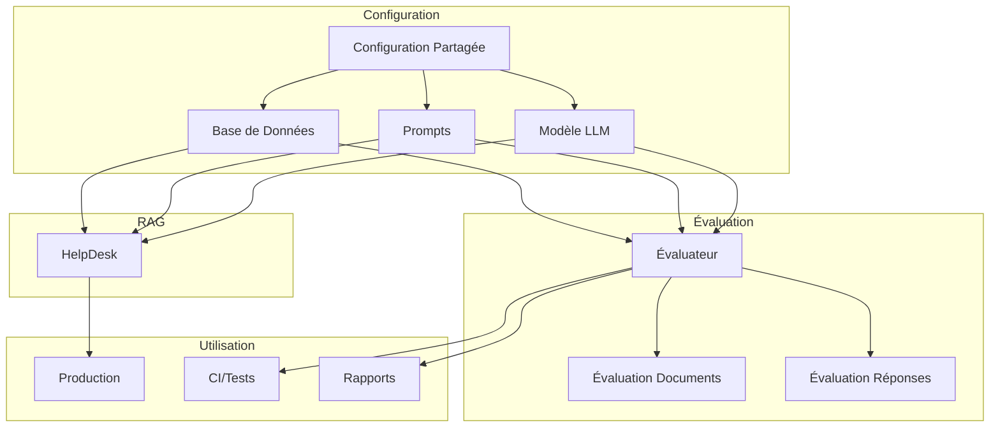

# Conception du Système d'Évaluation RAG

Ce document décrit la conception d'un système d'évaluation pour le RAG (Retrieval-Augmented Generation) d'Isschat. Le système permet d'évaluer à la fois la pertinence des documents récupérés et la qualité des réponses générées.

## Vue d'ensemble

Le système d'évaluation utilise un LLM comme juge pour évaluer les performances du système RAG. Pour chaque question du jeu de test, le système :
1. Exécute le RAG pour obtenir les documents et la réponse
2. Évalue la pertinence des documents récupérés par rapport au contexte attendu
3. Évalue la qualité de la réponse générée par rapport à la réponse attendue
4. Génère un rapport détaillé des résultats

Chaque évaluation produit un résultat binaire : "plutôt bien" ou "plutôt mauvais", avec une explication.

## Architecture



## Composants Clés

### 1. Configuration Centralisée

La configuration est centralisée pour permettre de partager les mêmes paramètres entre le système RAG et le système d'évaluation.

```python
from typing import Union, Literal, Optional, Dict, Any
from pydantic import BaseModel, Field
import os
from enum import Enum
from functools import lru_cache

class DatabaseType(str, Enum):
    REAL = "real"  # Base de données réelle (FAISS, etc.)
    MOCK = "mock"  # Base de données mockée pour les tests

class LLMConfig(BaseModel):
    """Configuration du modèle LLM partagée par tous les composants"""
    model_name: str = "deepseek/deepseek-chat"
    temperature: float = 0.1
    api_key: str = ""
    api_base: str = "https://openrouter.ai/api/v1"
    max_tokens: int = 512

class DatabaseConfig(BaseModel):
    """Configuration de la base de données"""
    type: DatabaseType = DatabaseType.REAL
    persist_directory: str = "db"
    # Configuration pour la base mockée
    mock_data: Optional[Dict[str, Any]] = None

class PromptConfig(BaseModel):
    """Configuration des prompts"""
    rag_template: str = """
    You are a professional and friendly virtual assistant named "Confluence Assistant".
    Your mission is to help users find information in the Confluence documentation.

    Based on these text excerpts:
    -----
    {context}
    -----

    Answer the following question IN FRENCH in a conversational and professional manner.
    Use a friendly but professional tone, as if you were a helpful colleague.
    Be concise but complete. Use French phrases like "je vous suggère de..."
    (I suggest that you...), "vous pourriez..." (you could...), etc.
    If you don't have the information, clearly state so and suggest alternatives.
    IMPORTANT: Always respond in French regardless of the language of the question.

    Question: {question}
    Answer:
    """
    
    document_evaluation_template: str = """
    Tu es un juge expert chargé d'évaluer la pertinence des documents récupérés par un système RAG.
    
    Question posée au système: {question}
    
    Contexte qui aurait dû être récupéré:
    {contexte_attendu}
    
    Documents effectivement récupérés:
    {documents_recuperes}
    
    Évalue si les documents récupérés sont pertinents par rapport à la question et au contexte attendu.
    Réponds uniquement par "plutôt bien" si les documents contiennent l'information recherchée,
    ou "plutôt mauvais" s'ils ne sont pas pertinents.
    
    {format_instructions}
    """
    
    response_evaluation_template: str = """
    Tu es un juge expert chargé d'évaluer la qualité des réponses d'un assistant virtuel Confluence.
    
    Question posée: {question}
    
    Réponse attendue:
    {reponse_attendue}
    
    Réponse générée par le système:
    {reponse_generee}
    
    Évalue si la réponse générée répond correctement à la question posée et contient les informations clés
    présentes dans la réponse attendue. La réponse doit être en français et adopter un ton professionnel.
    
    Réponds uniquement par "plutôt bien" si la réponse est globalement correcte et pertinente,
    ou "plutôt mauvais" si elle est incorrecte ou incomplète.
    
    {format_instructions}
    """

class EvaluationConfig(BaseModel):
    """Configuration générale du système"""
    llm: LLMConfig = LLMConfig()
    database: DatabaseConfig = DatabaseConfig()
    prompts: PromptConfig = PromptConfig()
    evaluation_dataset_path: str = "data/evaluation_dataset.tsv"
    result_output_path: str = "data/evaluation_results.json"
    report_output_path: str = "data/evaluation_report.md"

@lru_cache()
def get_config() -> EvaluationConfig:
    """Récupère la configuration depuis les variables d'environnement ou utilise les valeurs par défaut"""
    # Chargement depuis les variables d'environnement ou fichier .env
    from dotenv import load_dotenv
    load_dotenv()
    
    # Configuration de base
    config = EvaluationConfig()
    
    # Mettre à jour avec les variables d'environnement
    if os.getenv("LLM_MODEL_NAME"):
        config.llm.model_name = os.getenv("LLM_MODEL_NAME")
    if os.getenv("LLM_API_KEY"):
        config.llm.api_key = os.getenv("LLM_API_KEY")
    if os.getenv("LLM_API_BASE"):
        config.llm.api_base = os.getenv("LLM_API_BASE")
    
    # Base de données mockée pour les tests CI si spécifié
    if os.getenv("USE_MOCK_DATABASE", "").lower() in ("true", "1", "yes"):
        config.database.type = DatabaseType.MOCK
    
    return config
```

### 2. Base de Données Mockée pour CI

Pour faciliter les tests CI, nous créons une base de données vectorielle mockée qui retourne des résultats prédéfinis.

```python
from langchain_core.documents import Document
from typing import List, Dict, Any
import json
from pathlib import Path

class MockVectorStore:
    """Base de données vectorielle mockée pour les tests CI"""
    
    def __init__(self, mock_data_path: str = None, mock_data: Dict[str, Any] = None):
        """
        Initialise une base de données vectorielle mockée
        
        Args:
            mock_data_path: Chemin vers un fichier JSON contenant les données mockées
            mock_data: Dictionnaire contenant les données mockées
        """
        self.data = {}
        
        if mock_data:
            self.data = mock_data
        elif mock_data_path:
            path = Path(mock_data_path)
            if path.exists():
                with open(path, "r", encoding="utf-8") as f:
                    self.data = json.load(f)
        
        # Format attendu pour self.data:
        # {
        #   "question1": [
        #     {"content": "...", "metadata": {"title": "...", "source": "..."}},
        #     {"content": "...", "metadata": {"title": "...", "source": "..."}}
        #   ],
        #   "question2": [ ... ]
        # }
        
        # Si aucune donnée n'est fournie, utiliser des données par défaut
        if not self.data:
            self.data = {
                "Comment ajouter une page?": [
                    {
                        "content": "Pour ajouter une page dans Confluence, cliquez sur le bouton '+' dans la barre de navigation...",
                        "metadata": {"title": "Création de pages", "source": "https://example.com/doc1"}
                    }
                ],
                "Comment gérer les permissions?": [
                    {
                        "content": "La gestion des permissions se fait dans les paramètres d'administration...",
                        "metadata": {"title": "Gestion des permissions", "source": "https://example.com/doc2"}
                    }
                ]
            }
    
    def as_retriever(self, search_kwargs=None):
        """Retourne un retriever mockée"""
        return MockRetriever(self.data)

class MockRetriever:
    """Retriever mockée pour les tests CI"""
    
    def __init__(self, mock_data: Dict[str, List[Dict[str, Any]]]):
        self.mock_data = mock_data
    
    def get_relevant_documents(self, query: str) -> List[Document]:
        """
        Récupère les documents pertinents pour une requête donnée
        
        Args:
            query: La requête utilisateur
            
        Returns:
            Liste de documents correspondant à la requête ou documents par défaut
        """
        # Recherche exacte (pour les tests)
        if query in self.mock_data:
            docs_data = self.mock_data[query]
        else:
            # Recherche partielle (mots-clés)
            for key, docs in self.mock_data.items():
                if any(word in key.lower() for word in query.lower().split()):
                    docs_data = docs
                    break
            else:
                # Document par défaut si aucune correspondance
                docs_data = list(self.mock_data.values())[0] if self.mock_data else []
        
        # Conversion en Documents LangChain
        docs = []
        for doc_data in docs_data:
            doc = Document(
                page_content=doc_data["content"],
                metadata=doc_data["metadata"]
            )
            docs.append(doc)
        
        return docs
```

### 3. Factory pour la Création de Composants

Un pattern Factory permet de créer les composants du système de manière cohérente et centralisée.

```python
from langchain_openai import ChatOpenAI
from langchain_core.prompts import PromptTemplate
from typing import Union, Optional
from src.help_desk import HelpDesk

class ComponentFactory:
    """Factory pour créer les différents composants du système"""
    
    @staticmethod
    def create_llm(config: EvaluationConfig) -> ChatOpenAI:
        """Crée une instance du modèle LLM basée sur la configuration"""
        return ChatOpenAI(
            model=config.llm.model_name,
            temperature=config.llm.temperature,
            openai_api_key=config.llm.api_key,
            openai_api_base=config.llm.api_base,
            max_tokens=config.llm.max_tokens
        )
    
    @staticmethod
    def create_rag_prompt(config: EvaluationConfig) -> PromptTemplate:
        """Crée le prompt pour le système RAG"""
        return PromptTemplate(
            template=config.prompts.rag_template,
            input_variables=["context", "question"]
        )
    
    @staticmethod
    def create_database(config: EvaluationConfig):
        """Crée la base de données (réelle ou mockée)"""
        if config.database.type == DatabaseType.MOCK:
            return MockVectorStore(mock_data=config.database.mock_data)
        else:
            # Utiliser la base de données réelle
            from load_db import DataLoader
            from langchain_huggingface import HuggingFaceEmbeddings
            
            # Créer les embeddings
            embeddings = HuggingFaceEmbeddings(model_name="all-MiniLM-L6-v2")
            
            # Charger la base de données
            loader = DataLoader(persist_directory=config.database.persist_directory)
            return loader.get_db(embeddings)
    
    @staticmethod
    def create_help_desk(config: EvaluationConfig, new_db: bool = False) -> HelpDesk:
        """
        Crée une instance de HelpDesk en utilisant la configuration partagée
        
        Si config.database.type est MOCK, utilise une base de données mockée
        Sinon, utilise la base de données réelle
        """
        # Si nous utilisons une base mockée, nous devons modifier le comportement
        if config.database.type == DatabaseType.MOCK:
            # Créer une classe dérivée qui utilise notre base mockée
            class MockHelpDesk(HelpDesk):
                def __init__(self, config: EvaluationConfig):
                    # Initialiser sans appeler le parent pour éviter de charger la vraie DB
                    self.new_db = False
                    self.template = config.prompts.rag_template
                    
                    # Créer les objets nécessaires
                    self.embeddings = HuggingFaceEmbeddings(model_name="all-MiniLM-L6-v2")
                    self.llm = ComponentFactory.create_llm(config)
                    self.prompt = ComponentFactory.create_rag_prompt(config)
                    
                    # Utiliser notre base mockée
                    self.db = MockVectorStore(mock_data=config.database.mock_data)
                    self.retriever = self.db.as_retriever()
                    
                    # Créer la chaîne de traitement
                    from langchain_core.runnables import RunnablePassthrough
                    from langchain_core.output_parsers import StrOutputParser
                    
                    self.retrieval_qa_chain = (
                        {"context": self.retriever, "question": RunnablePassthrough()}
                        | self.prompt
                        | self.llm
                        | StrOutputParser()
                    )
            
            return MockHelpDesk(config)
        else:
            # Utiliser l'implémentation normale mais avec nos configurations
            help_desk = HelpDesk(new_db=new_db)
            
            # Remplacer les composants par nos versions configurées
            help_desk.llm = ComponentFactory.create_llm(config)
            help_desk.prompt = ComponentFactory.create_rag_prompt(config)
            
            # Recréer la chaîne pour utiliser nos composants
            from langchain_core.runnables import RunnablePassthrough
            from langchain_core.output_parsers import StrOutputParser
            
            help_desk.retrieval_qa_chain = (
                {"context": help_desk.retriever, "question": RunnablePassthrough()}
                | help_desk.prompt
                | help_desk.llm
                | StrOutputParser()
            )
            
            return help_desk
```

### 4. Classes d'Évaluation

Les classes d'évaluation utilisent Pydantic pour définir les modèles de données et garantir une structure cohérente.

```python
from typing import List, Dict, Any
from pydantic import BaseModel, Field, ConfigDict
from enum import Enum
import pandas as pd
import json
from pathlib import Path
from langchain_core.output_parsers import PydanticOutputParser
from langchain_core.prompts import PromptTemplate

class Evaluation(str, Enum):
    PLUTOT_BIEN = "plutôt bien"
    PLUTOT_MAUVAIS = "plutôt mauvais"

class DocumentEvaluation(BaseModel):
    model_config = ConfigDict(extra="forbid")
    
    evaluation: Evaluation = Field(description="Évaluation globale des documents récupérés")
    raison: str = Field(description="Explication de l'évaluation")

class ReponseEvaluation(BaseModel):
    model_config = ConfigDict(extra="forbid")
    
    evaluation: Evaluation = Field(description="Évaluation globale de la réponse générée")
    raison: str = Field(description="Explication de l'évaluation")

class LLMEvaluateur:
    """Évaluateur utilisant le LLM configuré pour évaluer les documents et les réponses"""
    
    def __init__(self, config: EvaluationConfig):
        self.config = config
        self.llm = ComponentFactory.create_llm(config)
        
        # Parsers Pydantic pour les sorties structurées
        self.document_parser = PydanticOutputParser(pydantic_object=DocumentEvaluation)
        self.reponse_parser = PydanticOutputParser(pydantic_object=ReponseEvaluation)
    
    def evaluer_documents(self, question: str, contexte_attendu: str, documents_recuperes: List[Dict[str, Any]]) -> DocumentEvaluation:
        """Évalue la pertinence des documents récupérés"""
        prompt = PromptTemplate(
            template=self.config.prompts.document_evaluation_template,
            input_variables=["question", "contexte_attendu", "documents_recuperes"],
            partial_variables={"format_instructions": self.document_parser.get_format_instructions()}
        )
        
        # Formater les documents pour l'affichage
        docs_str = "\n".join([
            f"Document {i+1}:\nTitre: {doc.get('title', 'Inconnu')}\nContenu: {doc.get('content', 'Vide')[:300]}..." 
            for i, doc in enumerate(documents_recuperes)
        ])
        
        input_text = prompt.format(
            question=question,
            contexte_attendu=contexte_attendu,
            documents_recuperes=docs_str
        )
        
        output = self.llm.invoke(input_text)
        return self.document_parser.parse(output.content)
    
    def evaluer_reponse(self, question: str, reponse_attendue: str, reponse_generee: str) -> ReponseEvaluation:
        """Évalue la qualité de la réponse générée"""
        prompt = PromptTemplate(
            template=self.config.prompts.response_evaluation_template,
            input_variables=["question", "reponse_attendue", "reponse_generee"],
            partial_variables={"format_instructions": self.reponse_parser.get_format_instructions()}
        )
        
        input_text = prompt.format(
            question=question,
            reponse_attendue=reponse_attendue,
            reponse_generee=reponse_generee
        )
        
        output = self.llm.invoke(input_text)
        return self.reponse_parser.parse(output.content)

class QuestionEvaluation(BaseModel):
    """Évaluation complète pour une question"""
    question: str
    reponse_attendue: str
    contexte_attendu: str
    reponse_generee: str
    documents_recuperes: List[Dict[str, Any]]
    evaluation_documents: DocumentEvaluation
    evaluation_reponse: ReponseEvaluation

class EvaluationResultats(BaseModel):
    """Résultats d'évaluation complets"""
    resultats: List[QuestionEvaluation]
    
    @property
    def pourcentage_documents_bien(self) -> float:
        bons_docs = sum(1 for r in self.resultats if r.evaluation_documents.evaluation == Evaluation.PLUTOT_BIEN)
        return (bons_docs / len(self.resultats)) * 100 if self.resultats else 0
    
    @property
    def pourcentage_reponses_bien(self) -> float:
        bonnes_reponses = sum(1 for r in self.resultats if r.evaluation_reponse.evaluation == Evaluation.PLUTOT_BIEN)
        return (bonnes_reponses / len(self.resultats)) * 100 if self.resultats else 0
```

### 5. Gestionnaire d'Évaluation

Le gestionnaire d'évaluation coordonne le processus d'évaluation, de la lecture du dataset à la génération du rapport.

```python
class GestionnaireDEvaluation:
    """Gestionnaire principal pour l'évaluation du RAG"""
    
    def __init__(self, config: EvaluationConfig = None):
        """Initialise le gestionnaire avec la configuration donnée ou par défaut"""
        self.config = config or get_config()
        self.evaluateur = LLMEvaluateur(self.config)
        
        # Créer le modèle RAG avec notre factory
        self.rag_model = ComponentFactory.create_help_desk(self.config)
    
    def charger_dataset(self) -> pd.DataFrame:
        """Charge le dataset d'évaluation depuis le chemin configuré"""
        path = Path(self.config.evaluation_dataset_path)
        if not path.exists():
            # Créer un exemple de dataset si le fichier n'existe pas
            self.creer_dataset_exemple(path)
            
        return pd.read_csv(path, delimiter="\t")
    
    def creer_dataset_exemple(self, path: Path):
        """Crée un exemple de dataset d'évaluation"""
        # Créer le répertoire parent si nécessaire
        path.parent.mkdir(parents=True, exist_ok=True)
        
        # Exemple de données
        data = [
            ["Comment ajouter une page dans Confluence?", 
             "Pour ajouter une page dans Confluence, cliquez sur le bouton '+' dans la barre de navigation supérieure, puis sélectionnez 'Page'.", 
             "Création de pages, Navigation"],
            ["Comment gérer les permissions utilisateurs?", 
             "Pour gérer les permissions, accédez aux paramètres d'administration, puis 'Gestion des utilisateurs'.", 
             "Administration, Sécurité, Permissions"],
        ]
        
        # Créer le DataFrame et sauvegarder
        df = pd.DataFrame(data, columns=["Question", "Réponse Attendue", "Contexte Pertinent"])
        df.to_csv(path, sep="\t", index=False)
        
        print(f"Dataset d'exemple créé à {path}")
    
    def executer_evaluation(self) -> EvaluationResultats:
        """Exécute l'évaluation complète sur le dataset"""
        dataset = self.charger_dataset()
        resultats = []
        
        for i, row in dataset.iterrows():
            print(f"Évaluation de la question {i+1}/{len(dataset)}: {row['Question']}")
            
            question = row["Question"]
            reponse_attendue = row["Réponse Attendue"]
            contexte_attendu = row["Contexte Pertinent"]
            
            # Exécuter le RAG
            reponse_generee, sources = self.rag_model.retrieval_qa_inference(question, verbose=False)
            
            # Récupérer les documents
            documents_recuperes = self.rag_model.retriever.get_relevant_documents(question)
            docs_info = [
                {
                    "title": doc.metadata.get("title", "Inconnu"),
                    "source": doc.metadata.get("source", "Inconnu"),
                    "content": doc.page_content
                }
                for doc in documents_recuperes
            ]
            
            # Évaluer les documents et la réponse
            eval_docs = self.evaluateur.evaluer_documents(question, contexte_attendu, docs_info)
            eval_reponse = self.evaluateur.evaluer_reponse(question, reponse_attendue, reponse_generee)
            
            # Stocker les résultats
            resultat_question = QuestionEvaluation(
                question=question,
                reponse_attendue=reponse_attendue,
                contexte_attendu=contexte_attendu,
                reponse_generee=reponse_generee,
                documents_recuperes=docs_info,
                evaluation_documents=eval_docs,
                evaluation_reponse=eval_reponse
            )
            
            resultats.append(resultat_question)
            
        return EvaluationResultats(resultats=resultats)
    
    def sauvegarder_resultats(self, resultats: EvaluationResultats, chemin: str = None):
        """Sauvegarde les résultats d'évaluation au format JSON"""
        chemin = chemin or self.config.result_output_path
        path = Path(chemin)
        
        # Créer le répertoire parent si nécessaire
        path.parent.mkdir(parents=True, exist_ok=True)
        
        with open(path, "w", encoding="utf-8") as f:
            f.write(resultats.model_dump_json(indent=2))
        
        print(f"Résultats sauvegardés dans {path}")
    
    def generer_rapport_markdown(self, resultats: EvaluationResultats, chemin: str = None):
        """Génère un rapport d'évaluation au format Markdown"""
        chemin = chemin or self.config.report_output_path
        path = Path(chemin)
        
        # Créer le répertoire parent si nécessaire
        path.parent.mkdir(parents=True, exist_ok=True)
        
        with open(path, "w", encoding="utf-8") as f:
            f.write("# Rapport d'Évaluation du Système RAG\n\n")
            
            # Résumé des performances
            f.write("## Résumé\n\n")
            f.write(f"- **Documents pertinents**: {resultats.pourcentage_documents_bien:.2f}%\n")
            f.write(f"- **Réponses correctes**: {resultats.pourcentage_reponses_bien:.2f}%\n\n")
            
            # Détails par question
            f.write("## Détails des évaluations\n\n")
            
            for i, res in enumerate(resultats.resultats):
                f.write(f"### Question {i+1}: {res.question}\n\n")
                
                f.write("#### Évaluation des documents\n\n")
                f.write(f"- **Résultat**: {res.evaluation_documents.evaluation.value}\n")
                f.write(f"- **Raison**: {res.evaluation_documents.raison}\n\n")
                
                f.write("#### Évaluation de la réponse\n\n")
                f.write(f"- **Résultat**: {res.evaluation_reponse.evaluation.value}\n")
                f.write(f"- **Raison**: {res.evaluation_reponse.raison}\n\n")
                
                f.write("#### Détails\n\n")
                f.write("**Réponse attendue**:\n")
                f.write(f"```\n{res.reponse_attendue}\n```\n\n")
                
                f.write("**Réponse générée**:\n")
                f.write(f"```\n{res.reponse_generee}\n```\n\n")
                
                f.write("---\n\n")
        
        print(f"Rapport généré dans {path}")
```

### 6. Mode CI avec Base de Données Mockée

Le mode CI permet d'exécuter l'évaluation avec une base de données mockée pour les tests automatisés.

```python
def configurer_pour_ci() -> EvaluationConfig:
    """Configure le système pour les tests CI avec une base mockée"""
    
    # Créer une configuration de base
    config = EvaluationConfig()
    
    # Configurer pour utiliser une base mockée
    config.database.type = DatabaseType.MOCK
    
    # Exemple de données mockées
    config.database.mock_data = {
        "Comment ajouter une page?": [
            {
                "content": "Pour ajouter une page dans Confluence, cliquez sur le bouton '+' dans la barre de navigation...",
                "metadata": {"title": "Création de pages", "source": "https://example.com/doc1"}
            }
        ],
        "Comment gérer les permissions?": [
            {
                "content": "La gestion des permissions se fait dans les paramètres d'administration...",
                "metadata": {"title": "Gestion des permissions", "source": "https://example.com/doc2"}
            }
        ]
    }
    
    # Chemins spécifiques pour les tests
    config.evaluation_dataset_path = "tests/data/evaluation_dataset.tsv"
    config.result_output_path = "tests/data/evaluation_results.json"
    config.report_output_path = "tests/data/evaluation_report.md"
    
    return config

def executer_evaluation_ci():
    """Exécute l'évaluation en mode CI"""
    
    # Obtenir la configuration pour la CI
    config = configurer_pour_ci()
    
    # Créer le gestionnaire d'évaluation
    evaluateur = GestionnaireDEvaluation(config)
    
    # Exécuter l'évaluation
    resultats = evaluateur.executer_evaluation()
    
    # Sauvegarder les résultats
    evaluateur.sauvegarder_resultats(resultats)
    
    # Générer un rapport
    evaluateur.generer_rapport_markdown(resultats)
    
    # Retourner les résultats pour vérification
    return resultats

def verifier_evaluation_ci(resultats: EvaluationResultats) -> bool:
    """Vérifie si les résultats de l'évaluation CI sont acceptables"""
    # Par exemple, exiger au moins 70% de bonnes réponses
    seuil_reponses = 70.0
    seuil_documents = 70.0
    
    reponses_ok = resultats.pourcentage_reponses_bien >= seuil_reponses
    documents_ok = resultats.pourcentage_documents_bien >= seuil_documents
    
    if reponses_ok and documents_ok:
        print(f"✅ Évaluation réussie: {resultats.pourcentage_reponses_bien:.2f}% bonnes réponses, {resultats.pourcentage_documents_bien:.2f}% bons documents")
        return True
    else:
        print(f"❌ Évaluation échouée:")
        if not reponses_ok:
            print(f"   - Réponses: {resultats.pourcentage_reponses_bien:.2f}% (seuil: {seuil_reponses}%)")
        if not documents_ok:
            print(f"   - Documents: {resultats.pourcentage_documents_bien:.2f}% (seuil: {seuil_documents}%)")
        return False
```

### 7. Script Principal

Point d'entrée principal du système d'évaluation, avec support pour les arguments de ligne de commande.

```python
def main():
    """Point d'entrée principal pour l'évaluation"""
    import argparse
    
    parser = argparse.ArgumentParser(description="Système d'évaluation RAG")
    parser.add_argument("--ci", action="store_true", help="Exécuter en mode CI avec base mockée")
    parser.add_argument("--dataset", help="Chemin vers le dataset d'évaluation")
    parser.add_argument("--output", help="Chemin de sortie pour les résultats")
    parser.add_argument("--report", help="Chemin de sortie pour le rapport")
    args = parser.parse_args()
    
    if args.ci:
        print("Exécution en mode CI avec base mockée")
        resultats = executer_evaluation_ci()
        success = verifier_evaluation_ci(resultats)
        # Pour la CI, nous retournons un code d'erreur si l'évaluation échoue
        if not success:
            import sys
            sys.exit(1)
    else:
        # Mode normal avec configuration par défaut
        config = get_config()
        
        # Appliquer les arguments de ligne de commande
        if args.dataset:
            config.evaluation_dataset_path = args.dataset
        if args.output:
            config.result_output_path = args.output
        if args.report:
            config.report_output_path = args.report
            
        evaluateur = GestionnaireDEvaluation(config)
        
        print("Démarrage de l'évaluation...")
        resultats = evaluateur.executer_evaluation()
        
        # Sauvegarder les résultats
        evaluateur.sauvegarder_resultats(resultats)
        
        # Générer un rapport
        evaluateur.generer_rapport_markdown(resultats)
        
        # Afficher un résumé
        print("\n=== Résumé de l'évaluation ===")
        print(f"Documents pertinents: {resultats.pourcentage_documents_bien:.2f}%")
        print(f"Réponses correctes: {resultats.pourcentage_reponses_bien:.2f}%")

if __name__ == "__main__":
    main()
```

### 8. Intégration avec GitHub Actions

Pour l'intégration continue, nous pouvons utiliser un workflow GitHub Actions.

```yaml
# .github/workflows/rag-evaluation.yml
name: RAG Evaluation

on:
  push:
    branches: [ main ]
  pull_request:
    branches: [ main ]

jobs:
  evaluate:
    runs-on: ubuntu-latest
    
    steps:
    - uses: actions/checkout@v3
    
    - name: Set up Python
      uses: actions/setup-python@v4
      with:
        python-version: '3.10'
    
    - name: Install dependencies
      run: |
        python -m pip install --upgrade pip
        pip install -r requirements.txt
    
    - name: Run RAG evaluation in CI mode
      run: |
        python -m src.rag_evaluation --ci
    
    - name: Archive evaluation results
      uses: actions/upload-artifact@v3
      with:
        name: evaluation-results
        path: |
          tests/data/evaluation_results.json
          tests/data/evaluation_report.md
```

## Structure des Fichiers

```
Isschat/
├── data/
│   └── evaluation_dataset.tsv      # Dataset d'évaluation
├── src/
│   ├── evaluate.py                 # Ancienne évaluation (pour référence)
│   ├── help_desk.py                # Système RAG existant
│   ├── load_db.py                  # Chargeur de base de données existant
│   └── rag_evaluation/             # Nouveau système d'évaluation
│       ├── __init__.py
│       ├── config.py               # Configuration centralisée
│       ├── models.py               # Modèles Pydantic
│       ├── mock_db.py              # Base de données mockée
│       ├── factory.py              # Factory pour les composants
│       ├── evaluator.py            # Évaluateur LLM
│       ├── manager.py              # Gestionnaire d'évaluation
│       └── cli.py                  # Interface en ligne de commande
├── tests/
│   ├── data/                       # Données pour les tests CI
│   └── test_rag_evaluation.py      # Tests unitaires
└── .github/
    └── workflows/
        └── rag-evaluation.yml      # Configuration GitHub Actions
```

## Utilisation

### Mode Normal

```bash
python -m src.rag_evaluation.cli --dataset data/my_evaluation_dataset.tsv --output data/my_results.json --report data/my_report.md
```

### Mode CI

```bash
python -m src.rag_evaluation.cli --ci
```

## Format du Dataset d'Évaluation

Le dataset d'évaluation est un fichier TSV avec la structure suivante :

```
Question	Réponse Attendue	Contexte Pertinent
Comment ajouter une page dans Confluence?	Pour ajouter une page dans Confluence, cliquez sur le bouton "+" dans la barre de navigation supérieure, puis sélectionnez "Page". Vous pouvez alors choisir un modèle, ajouter un titre et du contenu, puis cliquer sur "Publier" pour créer la page.	Pages Confluence, Création de contenu, Navigation
Comment gérer les permissions utilisateurs?	Pour gérer les permissions utilisateurs dans Confluence, accédez aux paramètres d'administration, puis "Gestion des utilisateurs". Vous pouvez attribuer des rôles globaux ou des permissions spécifiques par espace. Les permissions peuvent être configurées à trois niveaux: global, espace, et page.	Administration, Sécurité, Permissions
```

## Configuration pour l'Intégration Continue (CI)

Pour mettre en place l'intégration continue avec GitHub Actions, vous pouvez créer un fichier `.github/workflows/rag-evaluation.yml` avec le contenu suivant :

```yaml
name: RAG Evaluation

on:
  push:
    branches: [ main ]
  pull_request:
    branches: [ main ]

jobs:
  evaluate:
    runs-on: ubuntu-latest
    
    steps:
    - uses: actions/checkout@v3
    
    - name: Set up Python
      uses: actions/setup-python@v4
      with:
        python-version: '3.10'
    
    - name: Install dependencies
      run: |
        python -m pip install --upgrade pip
        pip install -r requirements.txt
    
    - name: Run RAG evaluation in CI mode
      run: |
        # Configuration pour les tests CI
        export USE_MOCK_DATABASE=true
        python -m src.rag_evaluation.cli --ci
    
    - name: Archive evaluation results
      uses: actions/upload-artifact@v3
      with:
        name: evaluation-results
        path: |
          tests/data/evaluation_results.json
          tests/data/evaluation_report.md
```

Ce workflow exécutera automatiquement l'évaluation RAG à chaque push sur la branche principale et à chaque pull request, en utilisant une base de données mockée.

## Comment exécuter le système d'évaluation

### Mode Normal

Pour exécuter l'évaluation en mode normal, utilisez la commande suivante :

```bash
# Utilisation de base
python -m src.rag_evaluation.cli

# Avec des options personnalisées
python -m src.rag_evaluation.cli --dataset path/to/dataset.tsv --output path/to/results.json --report path/to/report.md

# Avec base de données mockée
python -m src.rag_evaluation.cli --db-mock
```

### Mode CI

Pour exécuter l'évaluation en mode CI (avec base de données mockée), utilisez :

```bash
python -m src.rag_evaluation.cli --ci
```

## Conclusion

Ce système d'évaluation RAG offre une approche flexible et robuste pour évaluer les performances du système de question-réponse basé sur la récupération. Il permet :

1. D'évaluer séparément la pertinence des documents récupérés et la qualité des réponses générées
2. D'utiliser un LLM comme juge pour obtenir des évaluations binaires ("plutôt bien" / "plutôt mauvais")
3. De partager la configuration entre le système RAG et le système d'évaluation
4. De mocker la base de données pour les tests CI
5. De générer des rapports détaillés
6. D'intégrer facilement les tests dans un workflow CI/CD

Cette architecture est conçue pour être facilement intégrable dans le projet existant et extensible pour des besoins futurs.